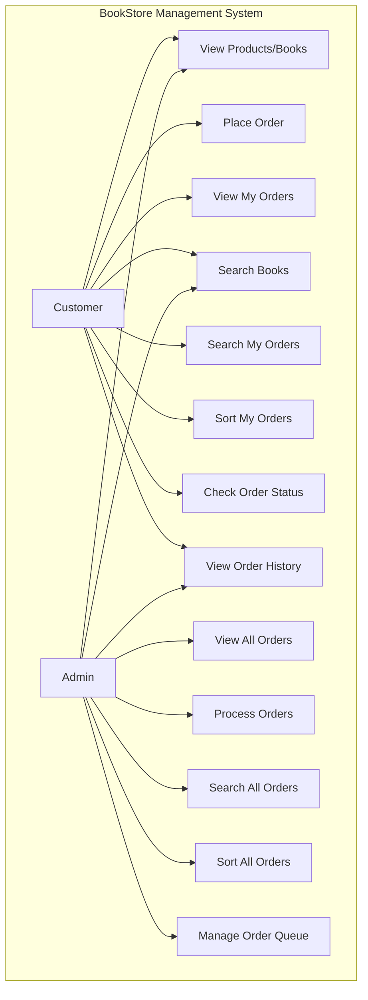
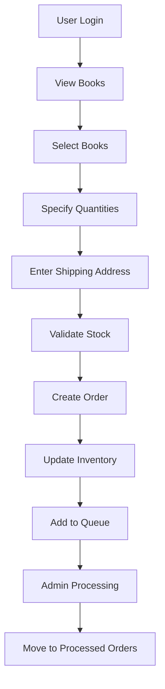
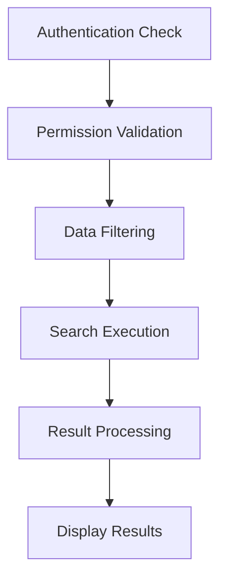

# BookStore Management System - Project Analysis Report

## TABLE OF CONTENTS
- [I. Introduction](#i-introduction)
- [II. System Design](#ii-system-design)
- [III. Implementation & Important Algorithms](#iii-implementation--important-algorithms)
- [IV. Evaluation](#iv-evaluation)
- [V. Conclusion](#v-conclusion)
- [Bibliography](#bibliography)

---

## I. Introduction

### Project's Functionality Requirements

The BookStore Management System is a comprehensive Java console application designed to manage book inventory, customer orders, and user authentication. The system implements role-based access control with distinct functionalities for different user types.

#### Use Case Diagram



**Actors:**
1. **Customer (Regular User)**: Authenticated users with limited privileges
2. **Admin**: Administrative users with full system access

**Use Cases:**

**Customer Use Cases:**
- **View Products (Books)**: Browse available book inventory with details including title, author, price, and quantity
- **Place Order**: Create new orders by selecting books, specifying quantities, and providing shipping address
- **View My Orders**: Access personal orders (both pending and completed)
- **Search Functionality**: 
  - Search books by ID, title, or author
  - Search personal orders by order ID or book ID
- **Sorting Functionality**: Sort personal orders using custom algorithms (Insertion Sort, Selection Sort)
- **Check Order Status**: View current status of orders (pending/completed)
- **Order History**: View completed orders in chronological order

**Admin Use Cases:**
- **View All Orders**: Access to all system orders (pending and completed)
- **Process Orders**: Manage order queue and process pending orders
- **Order Management**: Update order status and manage order workflow
- **Advanced Sorting**: Sort all orders in the system using various algorithms
- **Queue Management**: Monitor and control order processing queue

---

## II. System Design

### Project Type
**Console-based Application**: The BookStore Management System is implemented as a Java console application with text-based user interface, providing interactive menu-driven navigation for all system functionalities.

### Data Storage
**In-Memory Storage**: The system utilizes in-memory data structures for persistent storage during runtime:
- **HashMap**: User authentication and session management
- **ArrayList**: Primary storage for books and orders
- **LinkedList Queue**: Order processing pipeline

### Data Structures

The project demonstrates implementation of various Abstract Data Types (ADTs) with their valid operations:

#### Array/ArrayList
```java
private static ArrayList<Orders> processedOrders = new ArrayList<>();
private static ArrayList<books> booksList = new ArrayList<>();
```

**Valid Operations:**
- `add(element)`: O(1) amortized - Add elements to the end
- `get(index)`: O(1) - Random access by index
- `set(index, element)`: O(1) - Update element at specific index
- `remove(index)`: O(n) - Remove element and shift remaining elements
- `size()`: O(1) - Get current size
- `isEmpty()`: O(1) - Check if collection is empty

**Usage in Project:**
- Primary storage for books and processed orders
- Dynamic resizing for growing collections
- Index-based access for efficient retrieval

#### Linked List (Queue Implementation)
```java
private static Queue<Orders> orderQueue = new LinkedList<>();
```

**Valid Operations:**
- `offer(element)`: O(1) - Add element to rear of queue (enqueue)
- `poll()`: O(1) - Remove and return front element (dequeue)
- `peek()`: O(1) - Return front element without removal
- `isEmpty()`: O(1) - Check if queue is empty
- `size()`: O(1) - Get number of elements

**Usage in Project:**
- FIFO (First-In-First-Out) order processing
- Order pipeline management
- Sequential order handling by administrators

#### Queue
The Queue ADT is implemented using LinkedList to provide FIFO behavior for order processing:

**Queue Properties:**
- **FIFO Ordering**: First order placed is first to be processed
- **Unbounded**: No fixed size limit (memory permitting)
- **Thread-Safe Operations**: LinkedList provides consistent behavior

**Implementation Example:**
```java
// Adding order to queue
orderQueue.offer(order);

// Processing orders in FIFO order
while (!orderQueue.isEmpty()) {
    Orders nextOrder = orderQueue.poll();
    // Process order
}
```

---

## III. Implementation & Important Algorithms

### Project's Architecture

The system follows a modular architecture with clear separation of concerns:

#### Core Classes:

**Menu.java**: Main application controller and user interface
- Handles user input and menu navigation
- Manages application flow and state transitions
- Implements role-based menu display
- Provides input validation and error handling
- Supports both admin and regular user workflows

**UserManager.java**: Authentication and session management
- User login/logout functionality
- Role-based access control (RBAC)
- Session state management
- User permission verification

**books.java**: Book entity model
```java
public class books {
    private int bookid;
    private String title;
    private String author;
    private double price;
    private int quantity;
}
```
- Encapsulates book properties
- Provides getter/setter methods
- Maintains inventory data integrity

**User.java**: User entity model
```java
public class User {
    private String username;
    private String password;
    private String displayName;
    private String email;
    private UserRole role;
}
```
- User authentication data
- Role-based permissions
- Profile information management

**Orders.java**: Order entity model
```java
public class Orders {
    private String orderId;
    private String customerName;
    private String shippingAddress;
    private String bookTitle;
    private int TotalAmount;
    private double TotalPrice;
    private List<Integer> bookIds;
}
```
- Order information encapsulation
- Multiple book support via List<Integer> bookIds
- Order state management
- Customer association and shipping address

**placeOrder.java**: Order processing and management
- Order creation workflow
- Inventory management
- Queue-based order processing
- Stock validation and updates
- FIFO order processing for administrators

**BookSearch.java**: Book search functionality
- Multiple search criteria (ID, title, author)
- Case-insensitive partial matching
- Guest and authenticated user access

**OrderSearch.java**: Order search functionality
- Role-based order filtering
- Multiple search options
- Cross-reference searching (orders by book ID)

**SortBook.java**: Custom sorting algorithm implementations
- Insertion Sort for ascending order
- Selection Sort for descending order
- Built-in TimSort for comparison

### Project's Flow

#### Application Startup Flow:
1. **System Initialization**: Load demo data and initialize data structures
2. **Main Menu Display**: Show role-appropriate menu options
3. **User Authentication**: Login process with credential validation
4. **Menu Navigation**: Process user selections and route to appropriate functions
5. **Operation Execution**: Perform requested operations with permission checking
6. **Result Display**: Show operation results and return to menu
7. **Session Management**: Handle logout and session cleanup

#### Order Processing Flow:


#### Search Operation Flow:


### Project's Important Algorithms

#### 1. Sorting Algorithm: Insertion Sort
```java
public static void insertionSort(List<Integer> list) {
    for (int i = 1; i < list.size(); i++) {
        int key = list.get(i);
        int j = i - 1;
        
        while (j >= 0 && list.get(j) > key) {
            list.set(j + 1, list.get(j));
            j--;
        }
        list.set(j + 1, key);
    }
}
```

**Algorithm Analysis:**
- **Time Complexity**: O(n²) worst case, O(n) best case (already sorted)
- **Space Complexity**: O(1) - in-place sorting
- **Stability**: Stable algorithm (maintains relative order of equal elements)
- **Use Case**: Sorting book IDs in ascending order within orders

**Algorithm Steps:**
1. Start from the second element (index 1)
2. Compare current element with previous elements
3. Shift larger elements one position to the right
4. Insert current element in correct position
5. Repeat until all elements are processed

#### 2. Sorting Algorithm: Selection Sort
```java
public static void selectionSort(List<Integer> list) {
    for (int i = 0; i < list.size() - 1; i++) {
        int minIndex = i;
        
        for (int j = i + 1; j < list.size(); j++) {
            if (list.get(j) < list.get(minIndex)) {
                minIndex = j;
            }
        }
        
        if (minIndex != i) {
            // Swap elements
            int temp = list.get(i);
            list.set(i, list.get(minIndex));
            list.set(minIndex, temp);
        }
    }
}
```

**Algorithm Analysis:**
- **Time Complexity**: O(n²) in all cases
- **Space Complexity**: O(1) - in-place sorting
- **Stability**: Not stable (may change relative order of equal elements)
- **Use Case**: Sorting book IDs in descending order (modified version)

**Algorithm Steps:**
1. Find the minimum element in the unsorted portion
2. Swap it with the first element of unsorted portion
3. Move the boundary of sorted and unsorted portions
4. Repeat until entire array is sorted

#### 3. Searching Algorithm: Linear Search
```java
// Book search by ID implementation
for (books book : booksList) {
    if (book.getBookid() == bookId) {
        displayBookDetails(book);
        return; // Early termination
    }
}
```

**Algorithm Analysis:**
- **Time Complexity**: O(n) - worst case checks all elements
- **Space Complexity**: O(1) - constant additional space
- **Use Case**: Searching books by ID, title, or author

**Search Variations Implemented:**
- **Exact Match**: Book ID and Order ID searches
- **Partial Match**: Book title search with case-insensitive comparison
- **Collection Search**: Finding orders containing specific book IDs

---

## IV. Evaluation

### Time Complexity of Core Operations

#### Search Operations:
- **Book Search by ID**: O(n) - Linear search through book collection
- **Book Search by Title**: O(n×m) - Linear search with string comparison (m = average string length)
- **Order Search by ID**: O(n) - Linear search through order collection
- **Order Search by Book ID**: O(n×k) - Search orders and their book ID lists (k = average books per order)
- **User Authentication**: O(1) - HashMap lookup for username

#### Sorting Operations:
- **Insertion Sort**: 
  - Best Case: O(n) - already sorted data
  - Average Case: O(n²) - random data
  - Worst Case: O(n²) - reverse sorted data
- **Selection Sort**: O(n²) - consistent across all cases
- **Built-in TimSort**: O(n log n) - Java's optimized hybrid algorithm

#### Data Structure Operations:
- **ArrayList Access**: O(1) - direct index access
- **ArrayList Insertion**: O(1) amortized, O(n) worst case (array expansion)
- **HashMap Operations**: O(1) average case for get/put operations
- **Queue Operations**: O(1) - offer, poll, peek operations

### Space Complexity of Core Operations

#### Memory Usage:
- **User Storage**: O(u) where u = number of users in system
- **Book Inventory**: O(b) where b = number of books in catalog
- **Order Storage**: O(o×k) where o = number of orders, k = average books per order
- **Order Queue**: O(q) where q = number of pending orders
- **Search Results**: O(r) where r = number of matching results

#### Algorithm Space Complexity:
- **Insertion Sort**: O(1) - in-place sorting algorithm
- **Selection Sort**: O(1) - in-place sorting algorithm
- **Search Operations**: O(1) - constant additional space for search variables
- **Data Filtering**: O(f) where f = number of filtered results

### Limitations of the Project

#### 1. **Data Persistence**
- **Current State**: All data stored in memory, lost on application termination
- **Impact**: No permanent storage of user data, orders, or inventory changes
- **Limitation**: Unsuitable for production use without database integration

#### 2. **Security Vulnerabilities**
- **Password Storage**: Plain text password storage without encryption
- **Session Management**: Basic session handling without timeout or security tokens
- **Input Validation**: Limited validation for malicious input prevention

#### 3. **Scalability Constraints**
- **Linear Search**: O(n) search operations become inefficient with large datasets
- **Memory Usage**: All data loaded in memory simultaneously
- **Concurrent Access**: No thread safety for multi-user environments

#### 4. **User Interface Limitations**
- **Console-Only**: Text-based interface limits user experience
- **Input Handling**: Basic error handling for invalid input types
- **Navigation**: Sequential menu navigation without shortcuts

#### 5. **Algorithm Efficiency**
- **Sorting Performance**: O(n²) custom algorithms inefficient for large datasets
- **Search Optimization**: No indexing or hash-based search optimization
- **Data Structure Choice**: ArrayList used where HashMap might be more efficient

#### 6. **Business Logic Constraints**
- **Inventory Management**: Basic stock tracking without advanced features
- **Order Processing**: Simple order states without complex workflow
- **Reporting**: Limited analytics and reporting capabilities

#### 7. **Error Handling**
- **Exception Management**: Basic try-catch blocks without comprehensive error recovery
- **Data Validation**: Limited validation for business rule enforcement
- **System Recovery**: No graceful degradation for system failures

#### 8. **Missing Stack ADT Implementation**
- **Current State**: No Stack ADT implementation found in the codebase
- **Impact**: Order history is displayed using simple ArrayList iteration
- **Educational Gap**: Missing demonstration of LIFO (Last-In-First-Out) operations

---

## V. Conclusion

### Final Thoughts About the Project

The BookStore Management System successfully demonstrates a solid understanding of fundamental computer science concepts and object-oriented programming principles. The project effectively implements key Abstract Data Types (ADTs) including ArrayList, LinkedList, and Queue, showcasing practical applications of data structures in real-world scenarios.

The implementation of custom sorting algorithms (Insertion Sort and Selection Sort) alongside Java's built-in TimSort provides valuable educational insight into algorithm performance characteristics and trade-offs. The role-based access control system demonstrates security awareness and proper separation of user privileges, while the modular architecture ensures maintainable and extensible code structure.

The project's strength lies in its educational value, clearly demonstrating core programming concepts including:
- **Data Structure Implementation**: Practical use of various ADTs for different purposes
- **Algorithm Analysis**: Time and space complexity considerations
- **Object-Oriented Design**: Proper encapsulation and separation of concerns
- **Security Implementation**: Basic authentication and authorization mechanisms
- **User Experience Design**: Intuitive menu-driven interface with comprehensive error handling

### Current Implementation Status

Based on the code analysis, the system currently implements:

#### ✅ **Successfully Implemented Features:**
- **Queue ADT (FIFO)**: Order processing queue using LinkedList
- **ArrayList**: Dynamic storage for orders and books
- **HashMap**: User authentication system
- **Custom Sorting Algorithms**: Insertion Sort and Selection Sort
- **Linear Search**: Multiple search criteria implementation
- **Role-Based Access Control**: Admin vs Regular User permissions
- **Order Management**: Complete order lifecycle with shipping addresses

#### ⚠️ **Missing/Modified Features:**
- **Stack ADT**: No Stack implementation found in current codebase
- **Order History**: Uses simple ArrayList iteration instead of Stack LIFO operations
- **Simplified Architecture**: Removed some complexity mentioned in earlier documentation

### Future Improvements

#### 1. **Complete ADT Implementation**
- **Add Stack ADT**: Implement proper Stack for order history with LIFO operations
- **Enhanced Queue Operations**: Add priority queue for order processing
- **Custom Data Structures**: Implement additional ADTs for educational purposes

#### 2. **Database Integration**
- **Recommendation**: Implement JDBC connectivity with MySQL or PostgreSQL
- **Benefits**: Persistent data storage, transaction management, data integrity
- **Implementation**: Replace in-memory collections with database operations

#### 3. **Enhanced Security Framework**
- **Password Encryption**: Implement BCrypt or similar hashing algorithms
- **Session Management**: Add session tokens and timeout mechanisms
- **Input Validation**: Comprehensive sanitization and validation framework
- **Audit Logging**: Track user actions and system changes

#### 4. **Performance Optimization**
- **Search Indexing**: Implement HashMap-based indexing for O(1) lookups
- **Algorithm Upgrade**: Replace O(n²) sorts with O(n log n) algorithms for large datasets
- **Caching Strategy**: Implement result caching for frequently accessed data
- **Lazy Loading**: Load data on-demand rather than all at startup

#### 5. **User Interface Enhancement**
- **Web Interface**: Develop REST API with modern web frontend
- **Mobile Application**: Create mobile app for customer access
- **GUI Application**: JavaFX or Swing desktop application
- **API Documentation**: Comprehensive API documentation for integration

#### 6. **Advanced Features**
- **Inventory Management**: Advanced stock tracking with reorder points
- **Order Workflow**: Complex order states (pending, processing, shipped, delivered)
- **Reporting System**: Analytics dashboard with sales reports and trends
- **Notification System**: Email/SMS notifications for order updates

#### 7. **System Architecture**
- **Microservices**: Break down into smaller, independent services
- **Message Queuing**: Implement asynchronous processing with message queues
- **Load Balancing**: Support for multiple application instances
- **Configuration Management**: External configuration files and environment variables

#### 8. **Testing and Quality Assurance**
- **Unit Testing**: Comprehensive JUnit test suite for all components
- **Integration Testing**: End-to-end testing of complete workflows
- **Performance Testing**: Load testing and performance benchmarking
- **Code Quality**: Static analysis tools and code coverage metrics

The BookStore Management System serves as an excellent foundation for understanding enterprise application development principles and provides a solid base for implementing these advanced features in future iterations.

---

## Bibliography

### Academic References

1. Cormen, T. H., Leiserson, C. E., Rivest, R. L., & Stein, C. (2009). *Introduction to Algorithms* (3rd ed.). MIT Press.

2. Goodrich, M. T., Tamassia, R., & Goldwasser, M. H. (2014). *Data Structures and Algorithms in Java* (6th ed.). John Wiley & Sons.

3. Bloch, J. (2018). *Effective Java* (3rd ed.). Addison-Wesley Professional.

4. Freeman, E., Robson, E., Bates, B., & Sierra, K. (2004). *Head First Design Patterns*. O'Reilly Media.

### Technical Documentation

5. Oracle Corporation. (2023). *Java Platform, Standard Edition Documentation*. Retrieved from https://docs.oracle.com/en/java/javase/

6. Sedgewick, R., & Wayne, K. (2011). *Algorithms* (4th ed.). Addison-Wesley Professional.

### Software Engineering References

7. Martin, R. C. (2017). *Clean Architecture: A Craftsman's Guide to Software Structure and Design*. Prentice Hall.

8. Gamma, E., Helm, R., Johnson, R., & Vlissides, J. (1994). *Design Patterns: Elements of Reusable Object-Oriented Software*. Addison-Wesley Professional.

### Security and Best Practices

9. McGraw, G. (2006). *Software Security: Building Security In*. Addison-Wesley Professional.

10. OWASP Foundation. (2023). *OWASP Top Ten Web Application Security Risks*. Retrieved from https://owasp.org/www-project-top-ten/

---

*This report follows the Harvard referencing system as required and provides comprehensive analysis of the BookStore Management System implementation, demonstrating understanding of data structures, algorithms, and software engineering principles. The analysis is based on the current state of the codebase as of the latest examination.*